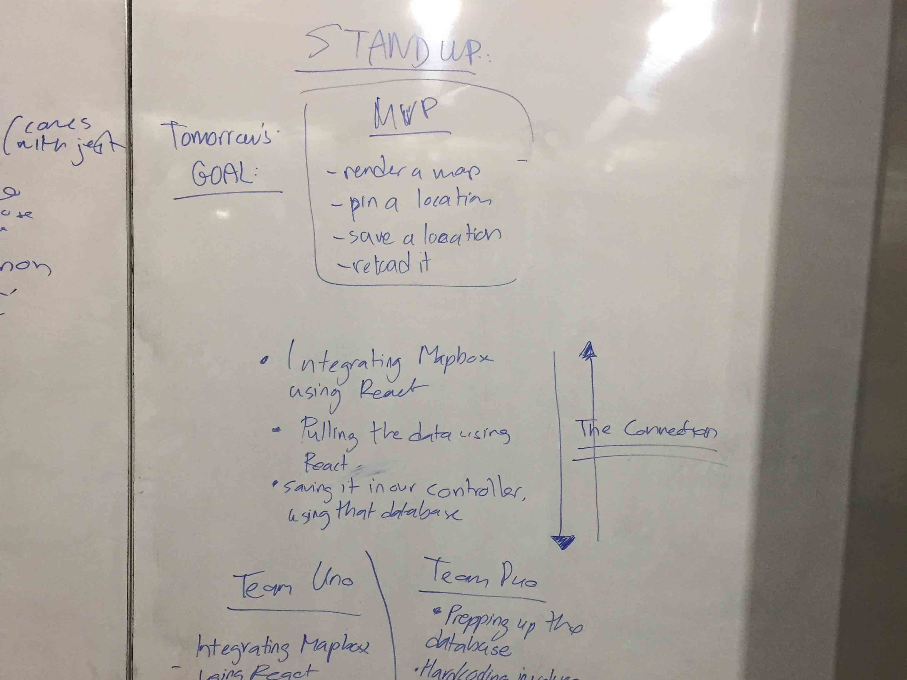
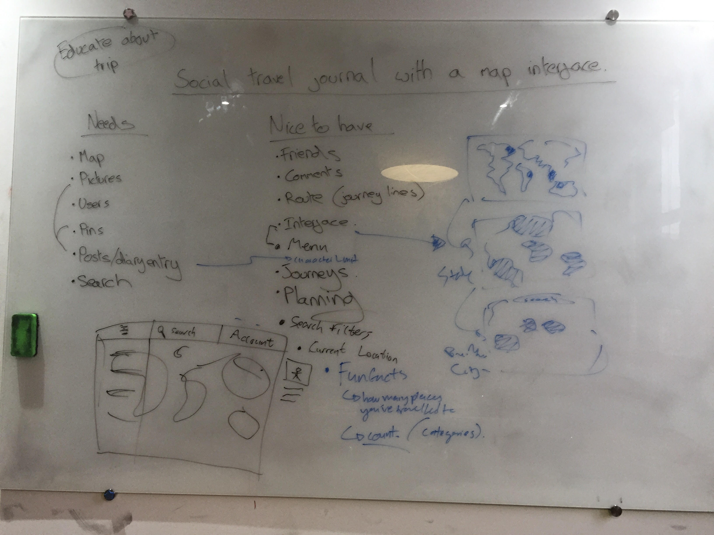
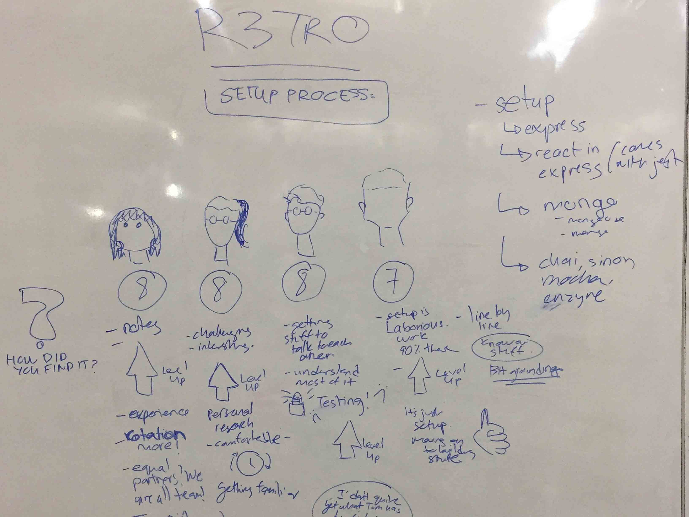
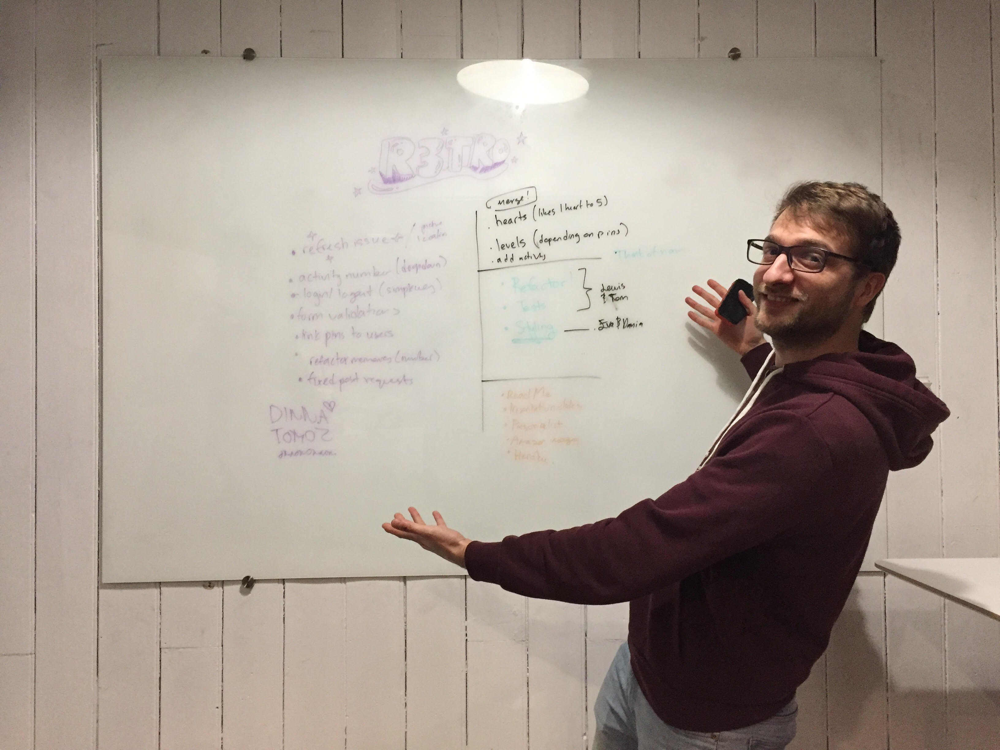

<h1 align="center">
  MemoMap 🗺
</h1>

**MemoMap** is a travel diary product done with an interactive map interface. It allows a user to personally document the places he or she has been, set some preferences and save it by their individual Facebook account. Memomap is an app that tracks one's memories whilst encourage one to make more. This was a Makers Academy's final project.

 For More Info: 

***
<h2> How to Use: </h2>

***

<h2> Technologies:  </h2>

Our team decided to implement this product as a MERN stack. A MERN stack is a full on javascript built product, which uses the following
technologies ( Mongo, Express, React and Node )

| Front-End     | Back-End      | Testing |
| :---:         |:---:          | :---:   |
| React         | Node          | Jest    |
| Mapbox        | Express       | Mocha   |
|               | Mongo         | Chai    |

How we set it up => [Set Up](https://hackernoon.com/episode-43-the-art-of-setting-up-a-mern-stack-final-project-week-d554bffe2c0e)

***

<h2> Approach: </h2>

  
  

  
  

Our collective approach was to make sure that  "everyone was on the same page in terms of understanding the code. We had StandUps and Retros everyday to check in on what tasks needed to be
done for the day and to check in how everyone was
finding the progress of each day. We always wrote
down what we achieved today to reflect upon and decide what needed to be done tomorrow.

 To strengthen our understanding of our code overall, we also switched pairs everyday so that everyone got exposure and could explore the different sections of the code. We were successful with our goals as we all got exposure to dealing with the front-end, back-end and testing frameworks.

PS: Yes, R3TRO was a thing in our team.
 

***

<h2> MVP & Functionalities: </h2>

***

<h2 align="center"> Team </h2>

🐱 [Dania Mah](https://github.com/thatdania)
| 🐰 [Eva Dinckel](https://github.com/evadinckel)
| 🐸 [Lewis Youl](https://github.com/LewisYoul)
| 🐨 [Tom Moir](https://github.com/tmerrr)

